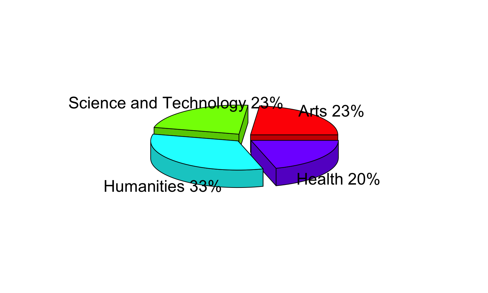

IHAC - Humanities, Arts and Science Institute
========================================================
author: Genaro Costa
date: April, 2015

History of the Institute
========================================================

The Humanities, Arts and Science Institute Milton Santos was created in 2009, and provides four main interdisciplinary courses:

- Humanities
- Arts
- Health
- Science and Tecnology

The institute access all classes avaliable to all coursers of the Federal University of Bahia. The followin data where collected from the students curriculum.

Active students on 2015, first semester
========================================================

    
In first smester of 2015 we had 4904 active students. 

Students application over years
========================================================

<iframe srcdoc=' &lt;!doctype HTML&gt;
&lt;meta charset = &#039;utf-8&#039;&gt;
&lt;html&gt;
  &lt;head&gt;
    &lt;link rel=&#039;stylesheet&#039; href=&#039;//cdnjs.cloudflare.com/ajax/libs/nvd3/1.1.15-beta/nv.d3.min.css&#039;&gt;
    
    &lt;script src=&#039;//ajax.googleapis.com/ajax/libs/jquery/1.8.2/jquery.min.js&#039; type=&#039;text/javascript&#039;&gt;&lt;/script&gt;
    &lt;script src=&#039;//d3js.org/d3.v3.min.js&#039; type=&#039;text/javascript&#039;&gt;&lt;/script&gt;
    &lt;script src=&#039;//cdnjs.cloudflare.com/ajax/libs/nvd3/1.1.15-beta/nv.d3.min.js&#039; type=&#039;text/javascript&#039;&gt;&lt;/script&gt;
    &lt;script src=&#039;//nvd3.org/assets/lib/fisheye.js&#039; type=&#039;text/javascript&#039;&gt;&lt;/script&gt;
    
    &lt;style&gt;
    .rChart {
      display: block;
      margin-left: auto; 
      margin-right: auto;
      width: 800px;
      height: 350px;
    }  
    &lt;/style&gt;
    
  &lt;/head&gt;
  &lt;body &gt;
    
    &lt;div id = &#039;chart7b4257fa4b46&#039; class = &#039;rChart nvd3&#039;&gt;&lt;/div&gt;    
    &lt;script type=&#039;text/javascript&#039;&gt;
 $(document).ready(function(){
      drawchart7b4257fa4b46()
    });
    function drawchart7b4257fa4b46(){  
      var opts = {
 &quot;dom&quot;: &quot;chart7b4257fa4b46&quot;,
&quot;width&quot;:    800,
&quot;height&quot;:    350,
&quot;x&quot;: &quot;year&quot;,
&quot;y&quot;: &quot;count&quot;,
&quot;group&quot;: &quot;course&quot;,
&quot;type&quot;: &quot;multiBarChart&quot;,
&quot;id&quot;: &quot;chart7b4257fa4b46&quot; 
},
        data = [
 {
 &quot;count&quot;: 242,
&quot;year&quot;: 2009,
&quot;course&quot;: &quot;Arts&quot; 
},
{
 &quot;count&quot;: 232,
&quot;year&quot;: 2010,
&quot;course&quot;: &quot;Arts&quot; 
},
{
 &quot;count&quot;: 225,
&quot;year&quot;: 2011,
&quot;course&quot;: &quot;Arts&quot; 
},
{
 &quot;count&quot;: 242,
&quot;year&quot;: 2012,
&quot;course&quot;: &quot;Arts&quot; 
},
{
 &quot;count&quot;: 263,
&quot;year&quot;: 2013,
&quot;course&quot;: &quot;Arts&quot; 
},
{
 &quot;count&quot;: 211,
&quot;year&quot;: 2014,
&quot;course&quot;: &quot;Arts&quot; 
},
{
 &quot;count&quot;: 250,
&quot;year&quot;: 2015,
&quot;course&quot;: &quot;Arts&quot; 
},
{
 &quot;count&quot;: 97,
&quot;year&quot;: 2009,
&quot;course&quot;: &quot;Science and Technology&quot; 
},
{
 &quot;count&quot;: 200,
&quot;year&quot;: 2010,
&quot;course&quot;: &quot;Science and Technology&quot; 
},
{
 &quot;count&quot;: 231,
&quot;year&quot;: 2011,
&quot;course&quot;: &quot;Science and Technology&quot; 
},
{
 &quot;count&quot;: 241,
&quot;year&quot;: 2012,
&quot;course&quot;: &quot;Science and Technology&quot; 
},
{
 &quot;count&quot;: 293,
&quot;year&quot;: 2013,
&quot;course&quot;: &quot;Science and Technology&quot; 
},
{
 &quot;count&quot;: 238,
&quot;year&quot;: 2014,
&quot;course&quot;: &quot;Science and Technology&quot; 
},
{
 &quot;count&quot;: 248,
&quot;year&quot;: 2015,
&quot;course&quot;: &quot;Science and Technology&quot; 
},
{
 &quot;count&quot;: 396,
&quot;year&quot;: 2009,
&quot;course&quot;: &quot;Humanities&quot; 
},
{
 &quot;count&quot;: 318,
&quot;year&quot;: 2010,
&quot;course&quot;: &quot;Humanities&quot; 
},
{
 &quot;count&quot;: 346,
&quot;year&quot;: 2011,
&quot;course&quot;: &quot;Humanities&quot; 
},
{
 &quot;count&quot;: 367,
&quot;year&quot;: 2012,
&quot;course&quot;: &quot;Humanities&quot; 
},
{
 &quot;count&quot;: 430,
&quot;year&quot;: 2013,
&quot;course&quot;: &quot;Humanities&quot; 
},
{
 &quot;count&quot;: 343,
&quot;year&quot;: 2014,
&quot;course&quot;: &quot;Humanities&quot; 
},
{
 &quot;count&quot;: 354,
&quot;year&quot;: 2015,
&quot;course&quot;: &quot;Humanities&quot; 
},
{
 &quot;count&quot;: 99,
&quot;year&quot;: 2009,
&quot;course&quot;: &quot;Health&quot; 
},
{
 &quot;count&quot;: 205,
&quot;year&quot;: 2010,
&quot;course&quot;: &quot;Health&quot; 
},
{
 &quot;count&quot;: 227,
&quot;year&quot;: 2011,
&quot;course&quot;: &quot;Health&quot; 
},
{
 &quot;count&quot;: 253,
&quot;year&quot;: 2012,
&quot;course&quot;: &quot;Health&quot; 
},
{
 &quot;count&quot;: 293,
&quot;year&quot;: 2013,
&quot;course&quot;: &quot;Health&quot; 
},
{
 &quot;count&quot;: 271,
&quot;year&quot;: 2014,
&quot;course&quot;: &quot;Health&quot; 
},
{
 &quot;count&quot;: 259,
&quot;year&quot;: 2015,
&quot;course&quot;: &quot;Health&quot; 
} 
]
  
      if(!(opts.type===&quot;pieChart&quot; || opts.type===&quot;sparklinePlus&quot; || opts.type===&quot;bulletChart&quot;)) {
        var data = d3.nest()
          .key(function(d){
            //return opts.group === undefined ? &#039;main&#039; : d[opts.group]
            //instead of main would think a better default is opts.x
            return opts.group === undefined ? opts.y : d[opts.group];
          })
          .entries(data);
      }
      
      if (opts.disabled != undefined){
        data.map(function(d, i){
          d.disabled = opts.disabled[i]
        })
      }
      
      nv.addGraph(function() {
        var chart = nv.models[opts.type]()
          .width(opts.width)
          .height(opts.height)
          
        if (opts.type != &quot;bulletChart&quot;){
          chart
            .x(function(d) { return d[opts.x] })
            .y(function(d) { return d[opts.y] })
        }
          
         
        
          
        

        
        
        
      
       d3.select(&quot;#&quot; + opts.id)
        .append(&#039;svg&#039;)
        .datum(data)
        .transition().duration(500)
        .call(chart);

       nv.utils.windowResize(chart.update);
       return chart;
      });
    };
&lt;/script&gt;
    
    &lt;script&gt;&lt;/script&gt;    
  &lt;/body&gt;
&lt;/html&gt; ' scrolling='no' frameBorder='0' seamless class='rChart  nvd3  ' id='iframe-chart7b4257fa4b46'> </iframe>
 
      
Classes positions occupied by students
========================================================

<iframe srcdoc=' &lt;!doctype HTML&gt;
&lt;meta charset = &#039;utf-8&#039;&gt;
&lt;html&gt;
  &lt;head&gt;
    &lt;link rel=&#039;stylesheet&#039; href=&#039;//tenxer.github.io/xcharts/css/master.css&#039;&gt;
    
    &lt;script src=&#039;//d3js.org/d3.v2.min.js&#039; type=&#039;text/javascript&#039;&gt;&lt;/script&gt;
    &lt;script src=&#039;//tenxer.github.io/xcharts/js/xcharts.min.js&#039; type=&#039;text/javascript&#039;&gt;&lt;/script&gt;
    
    &lt;style&gt;
    .rChart {
      display: block;
      margin-left: auto; 
      margin-right: auto;
      width: 800px;
      height: 300px;
    }  
    &lt;/style&gt;
    
  &lt;/head&gt;
  &lt;body &gt;
    
    &lt;figure id = &#039;chart7b425fc54147&#039; class = &#039;rChart xcharts&#039;&gt;&lt;/figure&gt;    
    &lt;script type=&#039;text/javascript&#039;&gt;
    var data = {
 &quot;dom&quot;: &quot;chart7b425fc54147&quot;,
&quot;width&quot;:    800,
&quot;height&quot;:    300,
&quot;xScale&quot;: &quot;ordinal&quot;,
&quot;yScale&quot;: &quot;linear&quot;,
&quot;main&quot;: [
 {
 &quot;data&quot;: [
 {
 &quot;x&quot;: &quot;2009-1&quot;,
&quot;y&quot;: 1183 
},
{
 &quot;x&quot;: &quot;2009-2&quot;,
&quot;y&quot;: 999 
},
{
 &quot;x&quot;: &quot;2010-1&quot;,
&quot;y&quot;: 1903 
},
{
 &quot;x&quot;: &quot;2010-2&quot;,
&quot;y&quot;: 1636 
},
{
 &quot;x&quot;: &quot;2011-1&quot;,
&quot;y&quot;: 2483 
},
{
 &quot;x&quot;: &quot;2011-2&quot;,
&quot;y&quot;: 2321 
},
{
 &quot;x&quot;: &quot;2012-1&quot;,
&quot;y&quot;: 2938 
},
{
 &quot;x&quot;: &quot;2012-2&quot;,
&quot;y&quot;: 2424 
},
{
 &quot;x&quot;: &quot;2013-1&quot;,
&quot;y&quot;: 3026 
},
{
 &quot;x&quot;: &quot;2013-2&quot;,
&quot;y&quot;: 2709 
},
{
 &quot;x&quot;: &quot;2014-1&quot;,
&quot;y&quot;: 2643 
},
{
 &quot;x&quot;: &quot;2014-2&quot;,
&quot;y&quot;: 2390 
},
{
 &quot;x&quot;: &quot;2015-1&quot;,
&quot;y&quot;: 3010 
} 
] 
},
{
 &quot;data&quot;: [
 {
 &quot;x&quot;: &quot;2009-1&quot;,
&quot;y&quot;: 513 
},
{
 &quot;x&quot;: &quot;2009-2&quot;,
&quot;y&quot;: 468 
},
{
 &quot;x&quot;: &quot;2010-1&quot;,
&quot;y&quot;: 1360 
},
{
 &quot;x&quot;: &quot;2010-2&quot;,
&quot;y&quot;: 1189 
},
{
 &quot;x&quot;: &quot;2011-1&quot;,
&quot;y&quot;: 2218 
},
{
 &quot;x&quot;: &quot;2011-2&quot;,
&quot;y&quot;: 2020 
},
{
 &quot;x&quot;: &quot;2012-1&quot;,
&quot;y&quot;: 2688 
},
{
 &quot;x&quot;: &quot;2012-2&quot;,
&quot;y&quot;: 2818 
},
{
 &quot;x&quot;: &quot;2013-1&quot;,
&quot;y&quot;: 3178 
},
{
 &quot;x&quot;: &quot;2013-2&quot;,
&quot;y&quot;: 3280 
},
{
 &quot;x&quot;: &quot;2014-1&quot;,
&quot;y&quot;: 3331 
},
{
 &quot;x&quot;: &quot;2014-2&quot;,
&quot;y&quot;: 3134 
},
{
 &quot;x&quot;: &quot;2015-1&quot;,
&quot;y&quot;: 3555 
} 
] 
},
{
 &quot;data&quot;: [
 {
 &quot;x&quot;: &quot;2009-1&quot;,
&quot;y&quot;: 1891 
},
{
 &quot;x&quot;: &quot;2009-2&quot;,
&quot;y&quot;: 1503 
},
{
 &quot;x&quot;: &quot;2010-1&quot;,
&quot;y&quot;: 2869 
},
{
 &quot;x&quot;: &quot;2010-2&quot;,
&quot;y&quot;: 2430 
},
{
 &quot;x&quot;: &quot;2011-1&quot;,
&quot;y&quot;: 3803 
},
{
 &quot;x&quot;: &quot;2011-2&quot;,
&quot;y&quot;: 3577 
},
{
 &quot;x&quot;: &quot;2012-1&quot;,
&quot;y&quot;: 4220 
},
{
 &quot;x&quot;: &quot;2012-2&quot;,
&quot;y&quot;: 4123 
},
{
 &quot;x&quot;: &quot;2013-1&quot;,
&quot;y&quot;: 4335 
},
{
 &quot;x&quot;: &quot;2013-2&quot;,
&quot;y&quot;: 4717 
},
{
 &quot;x&quot;: &quot;2014-1&quot;,
&quot;y&quot;: 4791 
},
{
 &quot;x&quot;: &quot;2014-2&quot;,
&quot;y&quot;: 4767 
},
{
 &quot;x&quot;: &quot;2015-1&quot;,
&quot;y&quot;: 5170 
} 
] 
},
{
 &quot;data&quot;: [
 {
 &quot;x&quot;: &quot;2009-1&quot;,
&quot;y&quot;: 476 
},
{
 &quot;x&quot;: &quot;2009-2&quot;,
&quot;y&quot;: 454 
},
{
 &quot;x&quot;: &quot;2010-1&quot;,
&quot;y&quot;: 1406 
},
{
 &quot;x&quot;: &quot;2010-2&quot;,
&quot;y&quot;: 1300 
},
{
 &quot;x&quot;: &quot;2011-1&quot;,
&quot;y&quot;: 2158 
},
{
 &quot;x&quot;: &quot;2011-2&quot;,
&quot;y&quot;: 1902 
},
{
 &quot;x&quot;: &quot;2012-1&quot;,
&quot;y&quot;: 2552 
},
{
 &quot;x&quot;: &quot;2012-2&quot;,
&quot;y&quot;: 2659 
},
{
 &quot;x&quot;: &quot;2013-1&quot;,
&quot;y&quot;: 2947 
},
{
 &quot;x&quot;: &quot;2013-2&quot;,
&quot;y&quot;: 3152 
},
{
 &quot;x&quot;: &quot;2014-1&quot;,
&quot;y&quot;: 3345 
},
{
 &quot;x&quot;: &quot;2014-2&quot;,
&quot;y&quot;: 3295 
},
{
 &quot;x&quot;: &quot;2015-1&quot;,
&quot;y&quot;: 3730 
} 
] 
} 
],
&quot;id&quot;: &quot;chart7b425fc54147&quot; 
},
      chartType = &quot;line-dotted&quot;,
      myChart = new xChart(chartType, data, &#039;#chart7b425fc54147&#039;);
&lt;/script&gt;
&lt;style&gt;figure.rChart {height: 400px;}&lt;/style&gt;
    
    &lt;script&gt;&lt;/script&gt;    
  &lt;/body&gt;
&lt;/html&gt; ' scrolling='no' frameBorder='0' seamless class='rChart  xcharts  ' id='iframe-chart7b425fc54147'> </iframe>
 
